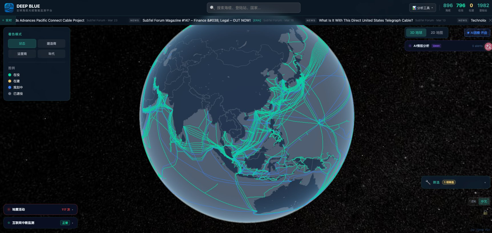

<p align="center">
  
</p>

<h1 align="center">🌊 Deep Blue</h1>

<p align="center">
  <b>全球海底光缆智能监测平台 | Global Submarine Cable Intelligence Platform</b>
</p>

<p align="center">
  <a href="https://www.deep-cloud.org">🌐 Live Demo</a> •
  <a href="#features--功能特性">✨ Features</a> •
  <a href="#tech-stack--技术栈">🛠 Tech Stack</a> •
  <a href="#getting-started--快速开始">🚀 Getting Started</a> •
  <a href="#license--许可证">📄 License</a>
</p>

<p align="center">
  
  
  
  
</p>

---



## What is Deep Blue? | 这是什么？

**English:** Deep Blue is the most comprehensive open-source submarine cable monitoring platform in the world. It aggregates data from multiple authoritative sources to provide real-time visualization of 883+ submarine cables, 1,982 landing stations across 186 countries — rendered on an interactive 3D globe powered by CesiumJS and a 2D map powered by MapLibre. It also features AI-powered news analysis, earthquake impact monitoring, and internet outage detection.

**中文：** Deep Blue 是全球最全面的开源海底光缆监测平台。它聚合多个权威数据源，实时可视化 883+ 条海底光缆、1,982 个登陆站（覆盖 186 个国家），基于 CesiumJS 3D 地球和 MapLibre 2D 地图双模式渲染。同时集成了 AI 新闻情报分析、地震影响监测和互联网中断检测等功能。

**100% free. 100% open source. Built by one person.**

**完全免费。完全开源。一人全栈开发。**

---

## Features | 功能特性

### 🌍 Interactive Globe & Map | 交互式地球与地图
- **3D Globe** (CesiumJS): Full 3D earth rendering with cable routes, landing stations, and earthquake ripple animations
- **2D Map** (MapLibre): Flat map view for detailed regional exploration
- Seamless switching between 3D and 2D modes

  3D 地球（CesiumJS）：完整的海缆路由渲染、登陆站标注、地震扩散圆动画。2D 地图（MapLibre）：平面视图，适合区域细节探索。3D/2D 无缝切换。

### 🔍 Smart Filtering | 智能筛选
- Filter cables by **status** (In Service / Under Construction / Planned / Decommissioned), **vendor**, **operator**, and **RFS year range**
- Cross-dimensional filtering with real-time count updates
- Color-coded cable rendering by status, vendor, or operator

  支持按状态、建造商、运营商、年代等多维筛选，实时计数联动，支持按维度着色。

### 🤖 AI Intelligence | AI 情报分析
- AI-powered submarine cable news analysis (powered by Qwen / 通义千问)
- Hourly precomputed analysis of industry news and events
- Bilingual support (English & Chinese)

  基于通义千问的海缆新闻 AI 分析，每小时预计算，中英双语支持。

### 🌋 Earthquake Monitoring | 地震监测
- Real-time earthquake data with submarine cable impact assessment
- Risk level classification (High / Medium / Low) based on proximity to cable routes
- Interactive ripple animations on the 3D globe for earthquake events

  实时地震数据 + 海缆影响评估，基于震源与海缆距离自动分级（高/中/低风险），3D 地球扩散圆动画。

### 🌐 Internet Outage Detection | 互联网中断检测
- Cloudflare Radar integration for real-time internet disruption monitoring
- Country-level outage alerts correlated with submarine cable infrastructure

  集成 Cloudflare Radar 实时互联网中断监测，国家级中断告警与海缆基础设施关联分析。

### 📊 Country Analysis | 国家分析
- Per-country submarine cable portfolio analysis
- Breakdown by international / domestic / branch cables
- Landing station details with bilingual names (Chinese + English)

  逐国海缆组合分析，国际线/国内线/分支线分类，登陆站中英双语名称。

### 📱 Mobile Support | 移动端适配
- Responsive 4-tab mobile UI for phones and tablets
- Full functionality on all screen sizes

  响应式 4-Tab 移动端界面，手机和平板完整功能支持。

---

## Tech Stack | 技术栈

| Layer | Technology |
|-------|-----------|
| Frontend | Next.js 16 + TypeScript + Tailwind CSS |
| Database | Supabase PostgreSQL + Prisma ORM |
| Cache | Upstash Redis |
| 3D Map | CesiumJS |
| 2D Map | MapLibre GL JS |
| AI | Qwen (通义千问) qwen-plus |
| Deployment | Vercel (frontend) + Tencent Cloud (ETL/cron) |
| Data Sources | TeleGeography + Submarine Networks |

---

## Data Sources | 数据来源

Deep Blue aggregates and deduplicates data from two authoritative submarine cable databases:

Deep Blue 聚合并去重了两个权威海缆数据库的数据：

- **[TeleGeography Submarine Cable Map](https://www.submarinecablemap.com/)** — The industry standard for submarine cable data (Tier 1, primary source)
- **[Submarine Networks](https://www.submarinenetworks.com/)** — Comprehensive coverage of regional and smaller cables (Tier 2, supplementary source)

A custom entity alignment and deduplication engine ensures no duplicate cables exist in the database, using structured name parsing, landing station set comparison, and RFS year matching.

内置自研的实体对齐与去重引擎，通过结构化名称解析、登陆站集合比较和 RFS 年份匹配，确保数据库中不存在重复海缆。

---

## Architecture | 系统架构

```
┌─────────────────┐     ┌──────────────────┐
│   Vercel CDN    │     │  Tencent Cloud   │
│   (Frontend)    │     │  (ETL / Cron)    │
├─────────────────┤     ├──────────────────┤
│ Next.js 16 SSR  │◄───►│ nightly-sync.ts  │
│ CesiumJS Globe  │     │ ai-precompute.ts │
│ MapLibre 2D     │     │ earthquake.ts    │
│ API Routes      │     │ geocode-fill.ts  │
└────────┬────────┘     └────────┬─────────┘
         │                       │
         ▼                       ▼
┌─────────────────┐     ┌──────────────────┐
│ Upstash Redis   │     │ Supabase         │
│ (Cache Layer)   │     │ (PostgreSQL)     │
└─────────────────┘     └──────────────────┘
         ▲                       ▲
         │                       │
    ┌────┴───────────────────────┴────┐
    │       Data Sources              │
    │  TeleGeography + SubNetworks    │
    │  Cloudflare Radar + USGS        │
    │  Qwen AI (News Analysis)        │
    └─────────────────────────────────┘
```

---

## Getting Started | 快速开始

### Prerequisites | 前提条件

- Node.js 18+
- PostgreSQL database (or [Supabase](https://supabase.com/) free tier)
- Redis instance (or [Upstash](https://upstash.com/) free tier)

### Installation | 安装

```bash
# Clone the repository | 克隆仓库
git clone https://github.com/yunny1/Deep-Blue.git
cd Deep-Blue

# Install dependencies | 安装依赖
npm install

# Set up environment variables | 配置环境变量
cp .env.example .env.local
# Edit .env.local with your database, Redis, and API keys
# 编辑 .env.local 填入你的数据库、Redis 和 API 密钥

# Generate Prisma client | 生成 Prisma Client
npx prisma generate

# Push database schema | 推送数据库结构
npx prisma db push

# Start development server | 启动开发服务器
npm run dev
```

Open [http://localhost:3000](http://localhost:3000) to see the app.

打开 [http://localhost:3000](http://localhost:3000) 查看应用。

### Environment Variables | 环境变量

| Variable | Description |
|----------|-------------|
| `DATABASE_URL` | PostgreSQL connection string |
| `UPSTASH_REDIS_REST_URL` | Upstash Redis REST URL |
| `UPSTASH_REDIS_REST_TOKEN` | Upstash Redis REST Token |
| `QWEN_API_KEY` | Qwen (通义千问) API key for AI analysis |
| `NEXT_PUBLIC_SITE_URL` | Your site URL (e.g., `https://www.deep-cloud.org`) |
| `CLOUDFLARE_RADAR_TOKEN` | Cloudflare Radar API token |
| `REVALIDATE_SECRET` | Secret for Vercel cache revalidation |

---

## Cron Jobs | 定时任务

These scripts run on the backend server (Tencent Cloud) to keep data fresh:

以下脚本在后端服务器（腾讯云）上定时运行，保持数据实时更新：

| Schedule | Script | Description |
|----------|--------|-------------|
| Daily 03:00 CST | `nightly-sync.ts` | Full data sync from TeleGeography + Submarine Networks |
| Daily 04:00 CST | `geocode-fill.ts` | Fill missing coordinates for landing stations |
| Hourly | `ai-precompute.ts` | AI news analysis precomputation |
| Every 5 min | `earthquake-precompute.ts` | Earthquake + cable impact assessment |

---

## Contributing | 贡献

Contributions are welcome! Feel free to open issues or submit pull requests.

欢迎贡献！可以提 Issue 或提交 Pull Request。

If you find this project useful, please consider giving it a ⭐ on GitHub!

如果你觉得这个项目有用，请在 GitHub 上给个 ⭐！

---

## Author | 作者

Built with ❤️ by **Jiangyun** — a solo full-stack developer passionate about submarine cable infrastructure and open data.

由 **Jiangyun** 独立全栈开发 ❤️ — 一个对海底光缆基础设施和开放数据充满热情的开发者。

---

## License | 许可证

This project is licensed under the [MIT License](LICENSE).

本项目基于 [MIT 许可证](LICENSE) 开源。
